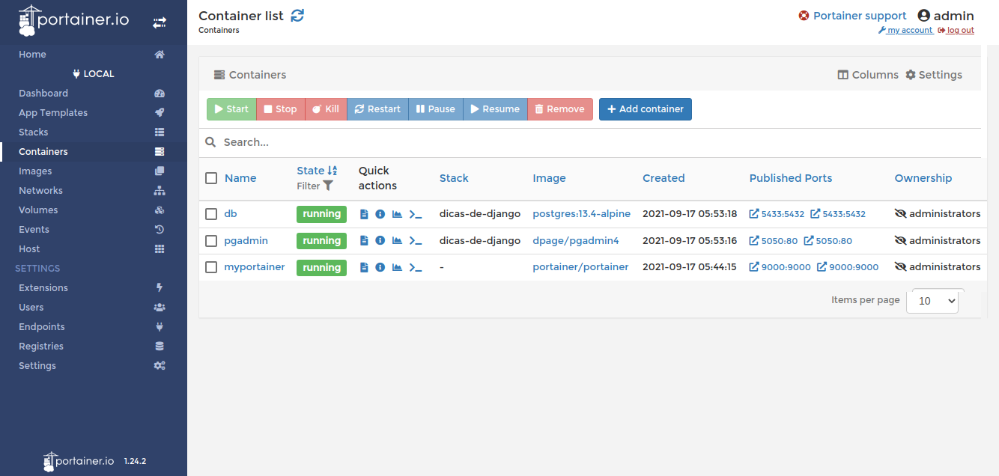
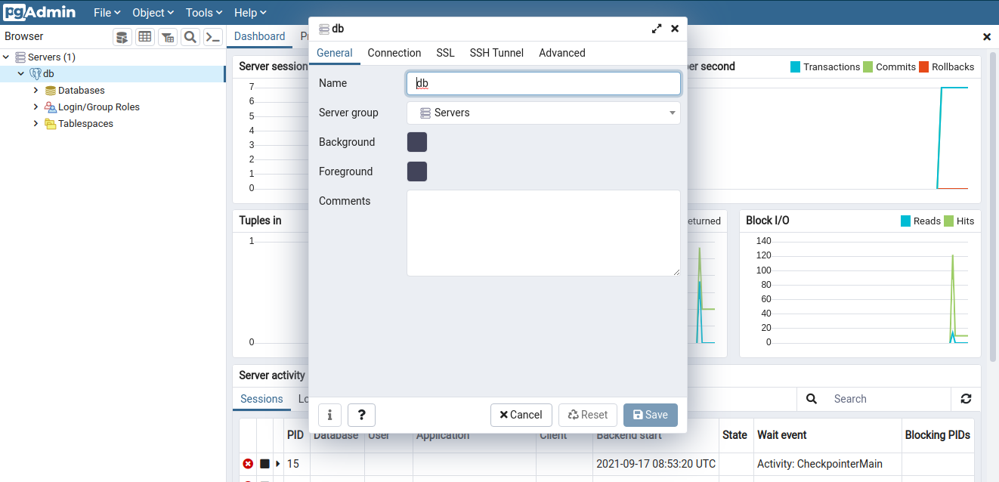
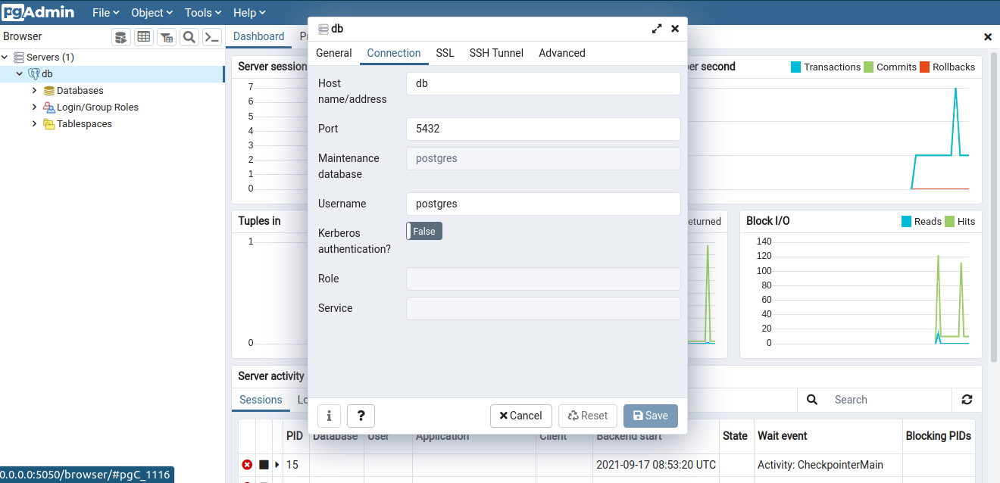

# Django Experience #22 - PostgreSQL + Docker + Portainer + pgAdmin + Django local

<a href="">
    
</a>

Agora nós vamos usar o PostgreSQL rodando dentro do Docker.

Instale o [docker](https://docs.docker.com/get-docker/) e o [docker-compose](https://docs.docker.com/compose/install/) na sua máquina.

```
docker --version
docker-compose --version
```

Vamos usar o [Portainer](https://www.portainer.io/) para monitorar nossos containers.

```
# Portainer
docker run -d \
--name myportainer \
-p 9000:9000 \
--restart always \
-v /var/run/docker.sock:/var/run/docker.sock \
-v /opt/portainer:/data \
portainer/portainer
```



### Escrevendo o `docker-compose.yml`

```yml
version: "3.8"

services:
  database:
    container_name: db
    image: postgres:13.4-alpine
    restart: always
    user: postgres  # importante definir o usuário
    volumes:
      - pgdata:/var/lib/postgresql/data
    environment:
      - LC_ALL=C.UTF-8
      - POSTGRES_PASSWORD=postgres  # senha padrão
      - POSTGRES_USER=postgres  # usuário padrão
      - POSTGRES_DB=db  # necessário porque foi configurado assim no settings
    ports:
      - 5433:5432  # repare na porta externa 5433
    networks:
      - postgres

  pgadmin:
    container_name: pgadmin
    image: dpage/pgadmin4
    restart: unless-stopped
    volumes:
       - pgadmin:/var/lib/pgadmin
    environment:
      PGADMIN_DEFAULT_EMAIL: admin@admin.com
      PGADMIN_DEFAULT_PASSWORD: admin
      PGADMIN_CONFIG_SERVER_MODE: 'False'
    ports:
      - 5050:80
    networks:
      - postgres

volumes:
  pgdata:  # mesmo nome do volume externo definido na linha 10
  pgadmin:

networks:
  postgres:
```

### Editando `settings.py`

```python
from decouple import Csv, config

DATABASES = {
    'default': {
        'ENGINE': 'django.db.backends.postgresql',
        'NAME': config('POSTGRES_DB', 'db'),  # postgres
        'USER': config('POSTGRES_USER', 'postgres'),
        'PASSWORD': config('POSTGRES_PASSWORD', 'postgres'),
        # 'db' caso exista um serviço com esse nome.
        'HOST': config('DB_HOST', '127.0.0.1'),
        'PORT': '5433',
    }
}
```

### Rodando os containers

```
docker-compose up -d
```

### Corrigindo um **erro** de instalação

```
django.core.exceptions.ImproperlyConfigured: Error loading psycopg2 module: No module named 'psycopg2'

pip install psycopg2-binary
pip freeze | grep psycopg2-binary >> requirements.txt
```

### Rodando as migrações

```
python manage.py migrate
```

### Criando um super usuário

```
python manage.py createsuperuser --username="admin" --email=""
python manage.py createsuperuser --username="regis" --email="regis@email.com"
```

### Entrando no container do banco pra conferir os dados

```
docker container exec -it db psql
# ou
docker container exec -it db psql -h localhost -U postgres db
```

```
\c db
\dt

SELECT username, email FROM auth_user;

# CREATE DATABASE db;
# CREATE DATABASE db OWNER postgres;
```

### Conferindo os logs

```
docker container logs -f db
```

Você também pode ver tudo pelo Portainer.


### Rodando o Django localmente

```
python manage.py runserver
```

## pgAdmin

Entre no pgAdmin.






